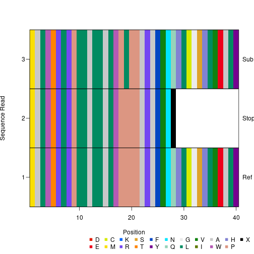
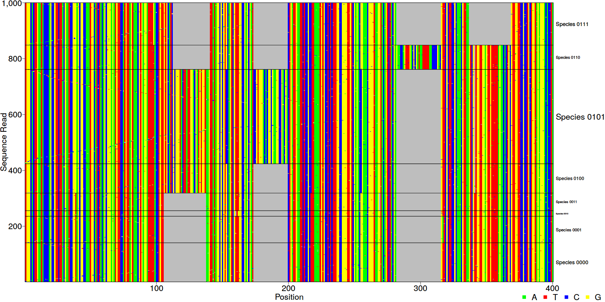

# DNAPlotR

[](https://travis-ci.org/sherrillmix/dnaplotr)
[](https://codecov.io/github/sherrillmix/dnaplotr?branch=master)

## Install
An R library to plot a visual representation of a vector of DNA sequences. To install directly from github, use the [<code>devtools</code>](https://github.com/hadley/devtools) library and run:


```r
devtools::install_github("sherrillmix/dnaplotr")
```
Then load the library as normal using:

```r
library(dnaplotr)
```

## Main functions
### plotDNA 
<code>plotDNA(seqs)</code> takes a character vector of strings representing DNA sequences and plots them to the current device. By default, A, C, T and G are colored, - are colored gray and all other characters are white. For example:


```r
seqs<-c('ACACA','ACACA','ACACT','ACA-A')
plotDNA(seqs)
```


### plotAA
<code>plotAA(seqs)</code> takes a character vector of strings representing amino acid sequences and plots them to the current device. By default, amino acids are colored according to a colorscheme modified from [JMol](http://jmol.sourceforge.net/jscolors/) that seeks to assign similar colors to amino acids with similar properties. In addition, - are colored gray, stop codons (annotated as X) are black and all other characters are white. For example:


```r
fakeAA<-c('MALWTRLRPLLALLALWPPPPARAFVNQHLCGSHLVEALY',
'MALWTRLRPLLALLALWPLPPARAFVNQHLCGSHLVEALY',
'MALWTRLRPLLALLALWPPPPARAFVNX')
plotAA(fakeAA,groups=c('Ref','Sub','Stop'))
```



## Helper functions

### replaceOuterGaps
<code>replaceOuterGaps(seqs)</code> marks gaps at the ends of sequences differently than internal indels.  For example:

```r
seqs<-c('--AA-A','--AA--','A-AA-A')
replaceOuterGaps(seqs)
```

```
## [1] "..AA-A" "..AA.." "A-AA-A"
```

### replaceAfterStop
<code>replaceAfterStop(seqs)</code> marks amino acids after a stop codon.  For example:


```r
seqs<-c('AAARXAA','AAARX','ARARAXRRAXAAR')
replaceAfterStop(seqs)
```

```
## [1] "AAARXXX"       "AAARX"         "ARARAXXXXXXXX"
```

## More complex example
A more complex example displaying 1000 sequences is:

```r
fakeSeqs<-createFakeDNA(1000)
refSeq<-fakeSeqs[1]
fakeSeqs<-fakeSeqs[-1]
species<-sprintf('Species %s',sub(' [0-9]+$','',names(fakeSeqs)))
par(mar=c(3.5,4.4,.5,7))
plotDNA(fakeSeqs,groups=species,groupCexScale=TRUE)
```

To produce something like:

See [generatePlots.R](generatePlots.R) or [inst/doc/example.pdf](the vignette) for complete plotting details.

